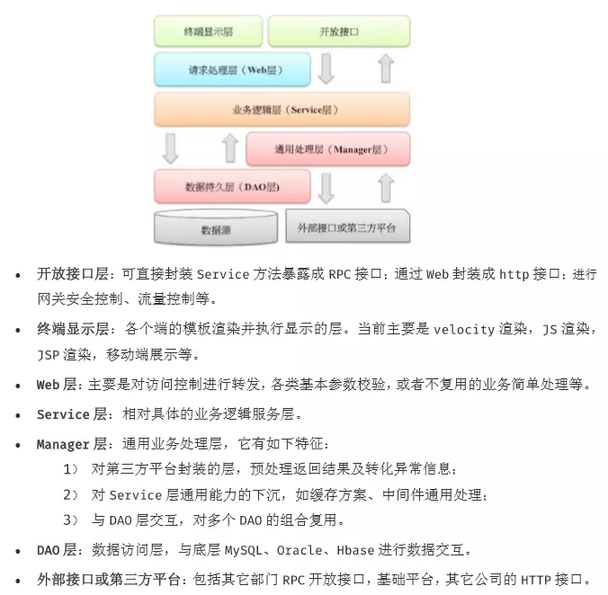

# Springboot2.4+HikariDataSource多数据源+DDS注解数据源切换+Swagger3.0
## 框架约定

### 应用分层（参考阿里巴巴Java开发手册）



## 包命名规范

1. 平台规定所有包的开头为 com.ksmart,maven 坐标的group为 ksmart;
2. 平台的包第三位为模块名称，第四位为业务实现或api接口区分位，分别对应biz或者api；
3. 在api模块中，第五位为领域模型,feign接口声明,模块特有工具包；分别对应 domain feign util
4. 在biz模块中，第五位为config,ctl,dao,domain,service,util,handler

> <font color=red>模块的启动类一律放在com.ksmart包下，否则无法扫描到框架和其他模块提供的注解及切面增强实现</font>

## 类命名规范

1. api中使用的传参类后缀为DTO
2. controller接口以Fegin结尾
3. dao,service分别以Dao,Service 结尾
4. service 接口以I开头


## 编码规范

1. 凡是service、dao中的方法，需要冠以数据操作视角的关键词作为前缀：
   * 新增： add ,create ,insert
   * 修改： update, modify
   * 删除： del, delete ,remove
   * 查询： query ,find ,get,select
2. 凡是方法参数超过三个，均需要使用对象封装参数，参数尽量为纯java基本类型或者对象DTO，DTO中需要使用swagger语法进行详细注释
3. 超过50行的代码，或者业务逻辑复杂，或者复用率高，一定要抽离到一个handler中；重复代码可按idea警告提示抽离；
4. 注释量不能小于代码行数的30%，越细致越好

## 数据源

### 前提：引入框架的动态数据源插件，如果你的模块不需要读写分离，在得到平台负责人批准，可以不引入框架动态数据源，以减少配置；

> <font color=red>注意不引入框架的动态数据源插件的模块无法与引入了框架动态数据源插件的模块集成模式运行</font>

1. 框架数据源注入遵循以下dao,domain,service 包路径扫描规则，不符合该规则无法正常使用数据源和注解

  ````
  com.ksmart.*.*.dao
  com.ksmart.*.*.domain
  com.ksmart.*.*.service
  ````

2. 数据源支持读写分离，默认走写节点，凡是service中方法名称前缀为 query,find,get,select 的方法均默认走只读数据源，如果需要走读写源需要加如下注解手动指定；

````
@DDS("master")
````

3. 如果需要打破以上第2点，自己灵活切换数据源可通过以下注解手动设置数据源，框架优先按注解需求处理数据源切换

````
@DDS("注册的数据源name")
````

4. 引入动态数据源插件后需要在启动类加@Import(DynamicDataSourceRegister.class)

````
package com.ksmart.pms.biz;
import com.ksmart.pms.biz.config.datasource.DynamicDataSourceRegister;
import org.springframework.boot.SpringApplication;
import org.springframework.boot.autoconfigure.SpringBootApplication;
import org.springframework.context.annotation.Import;
@Import(DynamicDataSourceRegister.class)
@SpringBootApplication
public class KsmartPmsBizApplication {

    public static void main(String[] args) {
        SpringApplication.run(KsmartPmsBizApplication.class, args);
    }

}
````

## 分页组件

1. 分页传参，currentPage 传N得到第N+1页,首次传0得到第1页；

## Swagger3

1. 默认不开启swagger，生产环境务必禁用swagger，可通过在配置文件中设置开启swagger：ksmart.swagger3.enable=true

2. swagger3 每个模块需要在自己模块的config下添加自己的swagger3config,代码模板如下

3. 访问地址：http://localhost:8080/swagger-ui/#/

````
package com.ksmart.pms.biz.config.swagger;

import com.ksmart.common.util.KUtil;
import org.springframework.beans.factory.annotation.Value;
import org.springframework.context.annotation.Bean;
import org.springframework.context.annotation.Configuration;
import springfox.documentation.builders.PathSelectors;
import springfox.documentation.builders.RequestHandlerSelectors;
import springfox.documentation.oas.annotations.EnableOpenApi;
import springfox.documentation.service.ApiInfo;
import springfox.documentation.service.Contact;
import springfox.documentation.spi.DocumentationType;
import springfox.documentation.spring.web.plugins.Docket;

import java.util.ArrayList;

@Configuration
@EnableOpenApi
public class Swagger3Config {
    @Value("${ksmart.swagger3.enable:false}")
    private boolean swaggerEnable;
    //自动根据当前类所在的包名获取模块名称
    private final String groupName= KUtil.getModuleNameByPackageName(this.getClass().getPackage().getName());
    //自动根据当前类所在的包名获取扫描controller路径
    private final String basePackage= KUtil.getModuleSwaggerScanBasePackageName(this.getClass().getPackage().getName());
    @Bean
    public Docket docket() {
        return new Docket(DocumentationType.OAS_30)
                //是否开启，根据环境配置
                .enable(swaggerEnable)
                .groupName(groupName)
                .apiInfo(apiInfo())
                .select()
                //指定扫描的包
                .apis(RequestHandlerSelectors.basePackage("com.ksmart.pms.biz.controller"))
                .paths(PathSelectors.any())
                .build();
    }
    /**
     * 页面基础信息
     */
    private ApiInfo apiInfo() {
        // 作者信息
        Contact contact = new Contact("PeterLee", "https://www.ksmart.com", "379266761@qq.com");
        return new ApiInfo(
                "ksmart的接口文档",
                "全网最新版本敏捷开发平台",
                "1.0",
                "https://www.ksmart.com",
                contact,
                "Apache 2.0",
                "http://www.apache.org/licenses/LICENSE-2.0",
                new ArrayList());
    }
}

````

